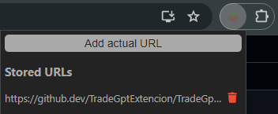
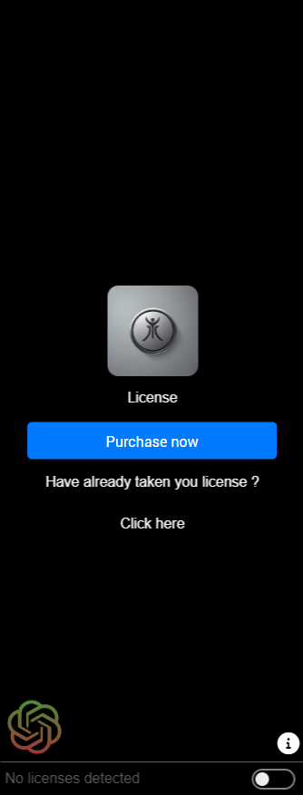
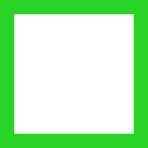

# Docs para o TradeGPT

Este Docs server para solucionar dúvidas e exclarer informações aos usuários do TradeGPT, lembre-se de ler atentamente aos detalhes enquanto consulta a documentação oficial.

* **Introdução** - **Adquirindo licença** setup.
* **Instalação** - **Adquira a extenção** google.

Após instalar a extenção do Google em seu navegador dirija-se habilite-a em seu site favorito através do gerenciar de extensões suspenso.

  

* **Após habilitar a extenção** um ícone do lado inferior esquerdo aparecerá.
* Caso ela não apareça de imediato recarregue a página.

 

* **Ao clicar no ícone** você verá uma sidebar abrindo, nela clique em ***Purchase now*** para adquirir uma licença e caso já tenha uma clique em ***Click here*** e insira-a.

  

* **Apenas uma única licença é permita por computador** Abaixo perceba que existe um indicar que detécta se existe licença presente no dispositivo usado.

 

* **Configuração completa** - **Licença em uso** agora que você configurou sua licença comece a usá-la.

* Clique em ***Add Image...*** e faça upload da ponta de um gráfico de velas.
* **Escolha a porcentagem de acerto** para melhores precisões e insights.
* Clique em ***Submit*** e aguarde a mágica.

 

* **Carregando velas** - **TradeGPT** em ação

https://github.com/TradeGptExtencion/TradeGptExtencion/assets/170668362/33f11e67-b4ea-47e2-b3e0-20f03ff3992e

 

* **Pontuações** - **Indicadores otimistas** para Traders

Acontece quando a IA consegue notar um insight pré-cauculado, cujo o valor das operações tende a ser otimista, ou seja, ao crescimento das ações, recomendamos comprar ativos quando obtiver este insight.

 

* **Pontuações** - **Indicadores pessimistas** para Traders

Acontece quando a IA consegue notar um insight pré-cauculado, cujo o valor das operações tende a ser pessimista, ou seja, ao decaimento das ações, recomendamos vender ativos quando obtiver este insight.

 

* **Pontuações** - **Indicadores irrealistas** para Traders

Acontece quando a IA consegue notar um insight pré-cauculado, cujo o valor das operações tende a não ser o esperado, ou seja, crescimentos ou decaimentos adiversos das ações, recomendamos não vender ou comprar ativos quando obtiver este insight. (Apesar de se tratar de um insight raro o ideal é não investir pelos próximos 90 segundos e analisar outra imagem após este período).

 

* **Pontuações** - **Sem indicadores** para Traders

Acontece quando a IA **não** consegue notar um insight pré-cauculado, cujo o valor das operações tende a ser irreal, ou seja, ele retorna a imagem como ela foi enviada, recomendamos modificar a porcentagem de acerto "acurácia" ao lado (número de 0 à 100) para um número menor do que o colocado. (Apesar de se tratar de um insight comum o ideal é modificar a porcentagem e em caso de relutância aguardar pelos próximos 90 segundos e analisar outra imagem após este período).
